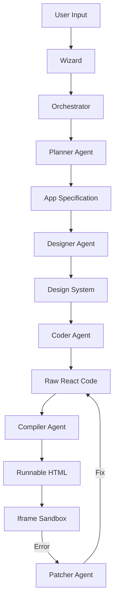

# System Architecture

## Overview

Agentic Studio Pro is a Single Page Application (SPA) built with React and Tailwind CSS. It simulates an Integrated Development Environment (IDE) where the "developer" is a swarm of AI agents.

## Core Components

### 1. The Orchestrator (`lib/orchestrator.ts`)
The central brain of the application. It acts as a finite state machine that transitions the application through various phases:
- `PLANNING` -> `DESIGNING` -> `ARCHITECTING` -> `CODING` -> `COMPILING`

It relies on the `aiClient` to perform the actual LLM calls but manages the side effects (updating UI state, logging).

### 2. AI Client (`lib/aiClient.ts`)
An abstraction layer over the Google GenAI SDK. It provides typed interfaces for specific tasks:
- `generateAppSpec`: Returns a structured JSON plan.
- `generateFileSet`: Returns code content.
- `compileToHtml`: Returns a standalone HTML string for the preview iframe.

### 3. State Management
The application state is held in the root `App.tsx` component and includes:
- **Files**: A virtual file system tree.
- **Logs**: A chronological list of agent actions.
- **CodeContent**: The raw string of the active file.
- **PreviewContent**: The compiled HTML/JS string.
- **ActiveAgent**: Which agent is currently "working".

### 4. Self-Healing Mechanism
The `Preview` component runs user code inside an `iframe`. 
- A custom error handler script is injected into the iframe during compilation.
- If the iframe throws an error, it `postMessage`s the error back to the parent window.
- `App.tsx` listens for this message and triggers the `orchestrator.healApp()` method.
- The **Patcher Agent** reads the error and the current code, generates a fix, and re-compiles.

## Data Flow

